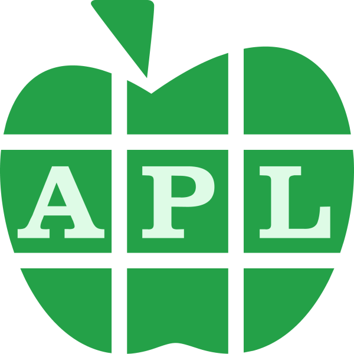
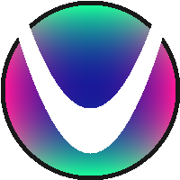

# 2024 Advent of Code

### Day  1: 
### Day  2: 
### Day  3: 
### Day  4: 
### Day  5: 
### Day  6: 
### Day  7: 
### Day  8: 
### Day  9: 
### Day 10: 
### Day 11: 
### Day 12: 
### Day 13: 
### Day 14: 
### Day 15: 
### Day 16: 
### Day 17: 
### Day 18: 
### Day 19: 
### Day 20: 
### Day 21: 
### Day 22: 
### Day 23: 
### Day 24: 
### Day 25: 
